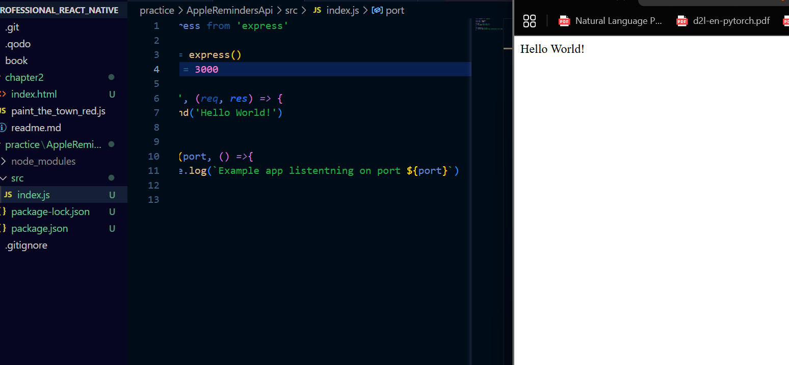
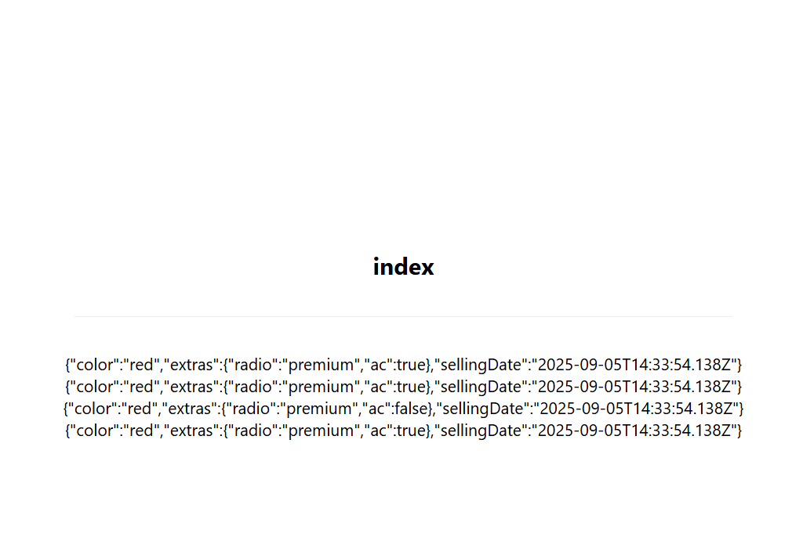
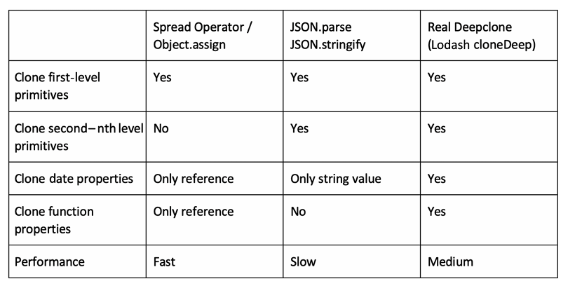

# ReminderAPI

https://notjust.notion.site/Apple-Reminders-Clone-Guide-1c9b0ec93c5a805a8b7cdb2692d431be?p=1c9b0ec93c5a8087ac0ad18e9b07ec58&pm=s


## Humble beginnings



creating copies of an object, only one option works

```js
export default function TabOneScreen() {

  const car = {
    color: 'red',
      extras: {
          radio: "premium",
          ac: false
      },
      sellingDate: new Date(),
      writeColor: function() {
        console.log('This car is ' + this.color)
      }
  };

  const _car = {...car};
  const _car2 = Object.assign({}, car)
  const _car3 = JSON.parse(JSON.stringify(car))

  car.extras.ac = true;

  console.log(_car)
  console.log(_car2)
  console.log(_car3)

  return (
    <View style={styles.container}>
      <Text style={styles.title}>index</Text>
      <View style={styles.separator} lightColor="#eee" darkColor="rgba(255,255,255,0.1)" />
      <Text>{JSON.stringify(_car)}</Text>
      <Text>{JSON.stringify(_car2)}</Text>
      <Text>{JSON.stringify(_car3)}</Text>
      <Text>{JSON.stringify(car)}</Text>
    </View>
  );
}

```



### spread operation

is a shallow clone.

### Object.assing

creates a reference copy

### Stringify and parse again

This creates a deep clone, however the data types like date are alos copied as clone of th estringifym thus losing meaning.

### Real Deepclone



We can use a clone like cloneDeep function


### implicit and explicit binding

```js
import { Pressable} from 'react-native';

class MyClass extends Component {
  constructor(props: any) {
    super(props);
    this.handlePress = this.handlePress.bind(this);
  }

  handlePress(event: any) {
    console.log(this);
  }

  render() {
    return (
      <Pressable onPress={this.handlePress}>
        <Text>Button</Text>
      </Pressable>
    );
  }
}

```

### Arrow functions

```
class MyClass2 extends Component {
  handlePress = (event: any) => {
    console.log(this);
  }

  render() {
    return (
      <Pressable onPress={this.handlePress}>
        <Text>MyClass2</Text>
      </Pressable>
    );
  }
}
```


